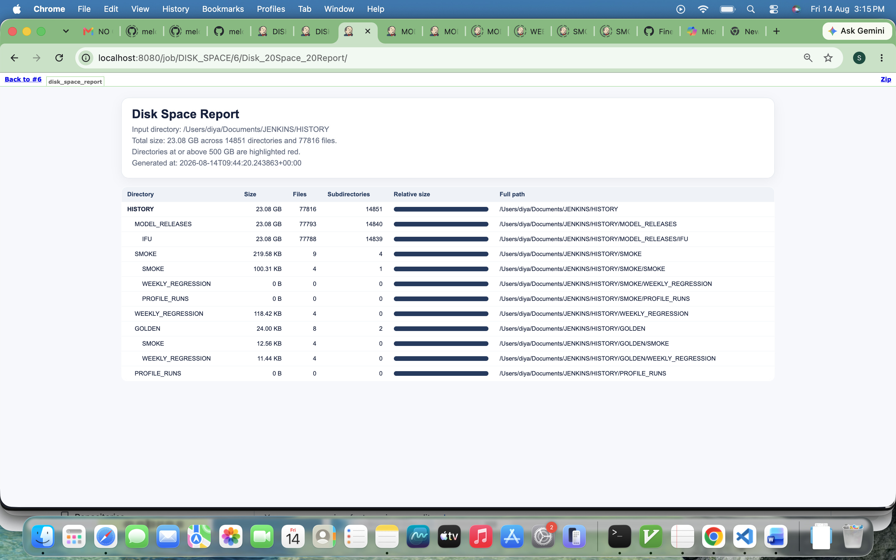

# DISK_SPACE

## Purpose

Scans a directory tree and reports how much disk space each subdirectory uses, so growth in
`gem5` build outputs, simulation results, and release history can be tracked and investigated
before it becomes a storage problem. Any directory at or above 500 GB is flagged so large
consumers stand out immediately.

## Industry Practice

Disk usage reporting alongside CI/CD pipelines is a standard operational practice: build and
test artifacts accumulate quickly, and a periodic, versioned usage report gives engineers a
concrete, timestamped record of where storage is being consumed instead of having to run manual
`du` commands under time pressure when a disk fills up.

## Files

- `disk_space_report.py` — walks a directory tree and writes JSON, plain-text, and HTML reports.
- `jenkins_disk_space.groovy` — Jenkins pipeline that checks out this repository and runs the
  script against a chosen `INPUT_DIR`.
- `docs/jenkins_disk_space_report.png` — screenshot of the published "Disk Space Report" page.

## Running Directly

```bash
python3 JENKINS/DISK_SPACE/disk_space_report.py \
    --input-dir /Users/shreyas/Documents/JENKINS/HISTORY \
    --max-depth 2
```

### CLI Options

| Flag | Required | Description |
| --- | --- | --- |
| `--input-dir` | Yes | Root directory to scan. |
| `--output-dir` | No | Where to write the reports. Defaults to `<input-dir>/DISK_SPACE/DISK_SPACE_BUILD_<N>` (build number under Jenkins, otherwise a UTC timestamp). |
| `--max-depth` | No | Maximum directory depth to descend into. Unlimited by default. |
| `--top` | No | Only show the N largest subdirectories per level. Shows all by default. |
| `--dry-run` | No | Scan and print a preview without writing any report files. |

### Default Output Location

Leaving `--output-dir` empty nests every report inside the directory being scanned, for example:

```
<input-dir>/DISK_SPACE/DISK_SPACE_BUILD_7/
    disk_space_report.json
    disk_space_report.html
    disk_space_report.css
    disk_space_tree.txt
```

The reserved `DISK_SPACE` folder is always excluded from the scan itself, so a report never
inflates the size of the directory it was generated for, and repeat runs do not accumulate size
from earlier report folders.

If `--output-dir` is set explicitly, the report files are written directly into that path
instead of a nested, build-numbered folder.

## 500 GB Highlight

Any directory whose cumulative size is at or above 500 GB is marked `over_limit: true` in the
JSON tree and rendered as a red, bold row in the HTML report, so it is immediately visible
without reading every value.

## Jenkins Job

Parameters:

| Parameter | Description |
| --- | --- |
| `BRANCH` | Git branch to check out. Default: `stable`. |
| `REPO_URL` | Repository containing `disk_space_report.py`. |
| `INPUT_DIR` | Required root directory to scan. |
| `OUTPUT_DIR` | Optional explicit report location. Leave empty for the nested, build-numbered default. |
| `MAX_DEPTH` | Optional depth limit. |
| `TOP_N` | Optional per-level limit on the number of largest subdirectories shown. |
| `DRY_RUN` | Scan and preview without writing any report files. |

Pipeline stages:

1. `CHECKOUT_SOURCE` — clones `REPO_URL`/`BRANCH` so the workspace has `disk_space_report.py`.
2. `CHECK_REQUIRED_INPUTS` — blocks the build if `INPUT_DIR` is empty.
3. `RUN_DISK_SPACE_REPORT` — builds the CLI arguments and runs the script.
4. `post { always {} }` — resolves the correct report location (respecting `OUTPUT_DIR` when
   set, otherwise the nested `INPUT_DIR/DISK_SPACE/DISK_SPACE_*` folder), copies the HTML/CSS/
   JSON/text files into the workspace, archives them, and publishes a **Disk Space Report** tab
   via `publishHTML` — skipped entirely when `DRY_RUN` is set since no files were written.

Build history and artifacts are capped at the last 50 builds via `buildDiscarder`.

### Published Report Example



## Logging and Traceability

Every scan prints timestamped, unbuffered progress lines (`[DISK_SPACE] Scanning ...`,
`Wrote JSON report: ...`, and a `WARNING` line if any directory exceeds the 500 GB mark), so
Jenkins console output reflects real-time progress instead of appearing silent during a large
scan.
