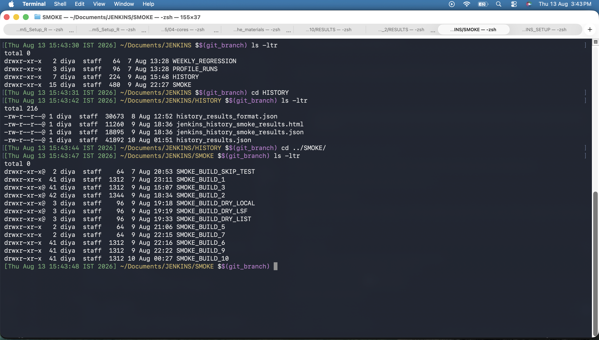
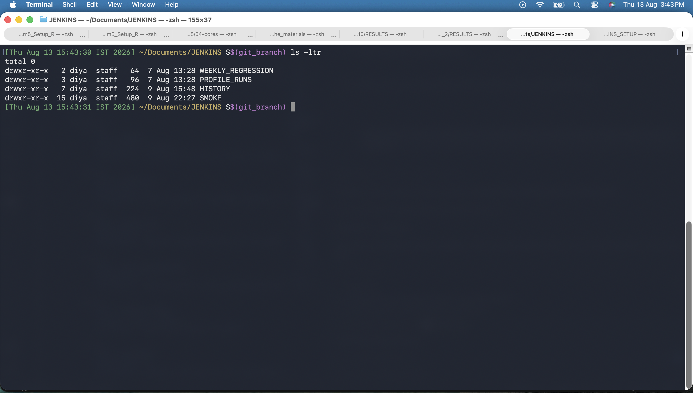
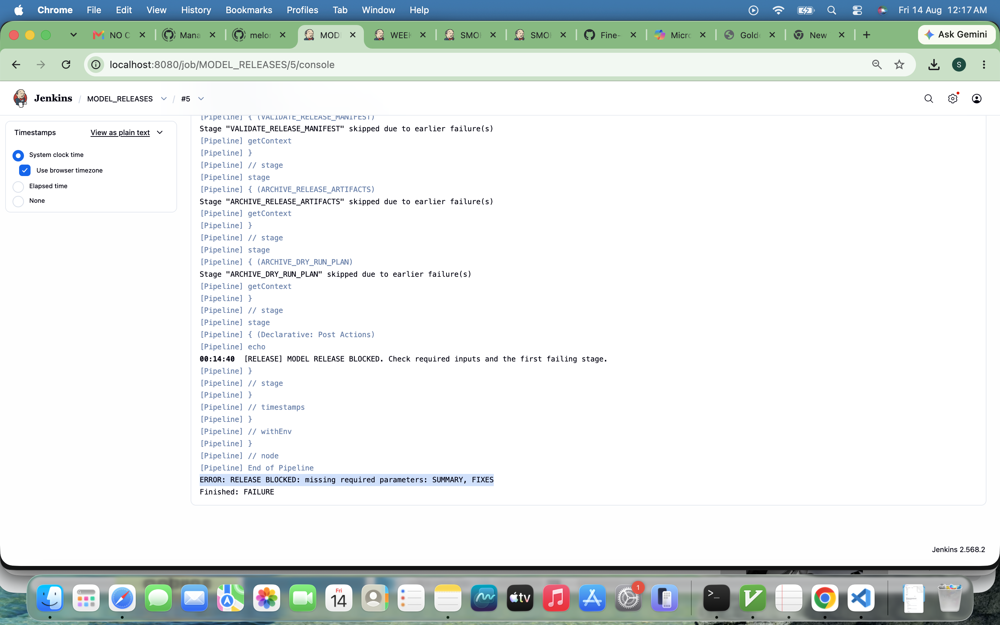

# JENKINS

This folder contains every CI/CD pipeline used for the `gem5` setup in this repository: compile
and simulate workflows, HTML/email reporting, golden-baseline regression comparison, versioned
model release automation, and disk usage monitoring. Each subfolder is a self-contained Jenkins
job with its own Python script(s), Groovy pipeline, and `README.md`. This file is the top-level
map of what exists and how the pieces fit together.

## Folder Map

| Folder | Jenkins Job Purpose |
| --- | --- |
| `SMOKE/` | Quick compile + smoke-test simulation on every relevant change, plus golden-baseline comparison. |
| `WEEKLY_REGRESSION/` | Same workflow as SMOKE, scheduled/run weekly for broader regression coverage. |
| `MODEL_RELEASES/` | Versioned, validated release process for individual POWER9 model units (IFU, BPU, FXU, etc.), with auto-versioning, dry-run, and email. |
| `PROFILE_RUNS/ASAN/` | Compile and run with AddressSanitizer instrumentation enabled, cloned from the SMOKE workflow. |
| `PROFILE_RUNS/PERF/` | Compile and run for performance profiling, cloned from the SMOKE workflow. |
| `DISK_SPACE/` | Scans any directory tree and reports per-directory disk usage, flagging directories at or above 500 GB. |
| `compare_golden_results.py` | Shared script (used by SMOKE and WEEKLY_REGRESSION) that compares a build's `stats.txt` values against per-chip GOLDEN baselines with a 5% tolerance. |

Every subfolder has its own `README.md` with full details (CLI options, Jenkins parameters,
pipeline stages, screenshots). This file gives the overview; the subfolder READMEs are the
source of truth for specifics.

## Common Conventions Across All Pipelines

- **Language**: Python 3 scripts (`argparse` CLI, `ArgumentDefaultsHelpFormatter`) driven by
  Jenkins Declarative Pipelines written in Groovy.
- **Checkout**: Every pipeline has an explicit `git branch: ..., url: ...` checkout step (not
  `checkout scm`), so the job works whether it's configured as "Pipeline script from SCM" or an
  inline "Pipeline script" pasted into the Jenkins UI.
- **Required-field blocking**: Jobs that create permanent records (for example MODEL_RELEASES)
  validate required parameters before doing any work and fail fast with a clear
  `RELEASE BLOCKED: ...` / `DISK SPACE BLOCKED: ...` style error if something required is
  missing.
- **HTML reporting**: Reports are written as standalone HTML files with an external CSS file
  (never inline `<style>` blocks), because Jenkins' default Content Security Policy blocks
  inline styles. Each job publishes its HTML report via `publishHTML` as a distinct tab on the
  build page.
- **JSON + text output**: Every report also has a JSON form (for programmatic consumption) and,
  where useful, a plain-text form (for quick reading in a terminal or log).
- **Logging**: Long-running steps (clone, compile, simulate, scan) print timestamped,
  unbuffered progress lines, so the Jenkins console reflects real-time progress instead of
  going silent during a multi-minute operation.
- **Build retention**: Pipelines that create Jenkins build history use
  `buildDiscarder(logRotator(numToKeepStr: '50'))` to cap console logs and archived artifacts at
  the last 50 builds, so Jenkins-side storage doesn't grow unbounded. This does not affect
  permanent, version-controlled release data on disk (for example MODEL_RELEASES version
  folders), which are kept indefinitely by design.
- **Commit messages**: Changes to these pipelines are committed with structured
  Problem/Changes/Workflow/Validation/Impact messages, using `git commit -F <file>` rather than
  `-m` with embedded newlines (zsh does not interpret `\n` inside a `-m` string).

## Prerequisites

Before creating or running a job, verify the following on the Jenkins agent:

1. Jenkins can execute Python 3, Git, and the gem5 build toolchain (`scons`).
2. The agent has enough disk space for cloned repositories, `build/ALL/` binaries, simulation
  output, reports, and archived Jenkins artifacts.
3. The Jenkins process can read and write the configured history directories. The current
  examples use `/Users/shreyas/Documents/JENKINS/...`; change these paths together if the
  agent uses a different home directory.
4. The Jenkins HTML Publisher plugin is installed for `publishHTML` steps.
5. The repository URL and branch are reachable from the agent. Jobs use the `stable` branch
  by default and perform an explicit checkout.
6. SMTP settings are available only when email delivery is enabled. Passwords should be stored
  as Jenkins credentials rather than committed in a pipeline or passed in plain text.

## Standard Job Setup

For each job, create a Pipeline project in Jenkins and choose one of these configurations:

| Configuration | Use |
| --- | --- |
| Pipeline script from SCM | Recommended. Select Git, repository URL, branch, and the Groovy path listed below. |
| Pipeline script | Acceptable for local testing, but paste the current Groovy file and refresh it after every push. |

When using Pipeline script from SCM, the paths are:

| Job | Script path |
| --- | --- |
| SMOKE | `JENKINS/SMOKE/jenkins_smoke.groovy` |
| WEEKLY_REGRESSION | `JENKINS/WEEKLY_REGRESSION/jenkins_weekly.groovy` |
| MODEL_RELEASES | `JENKINS/MODEL_RELEASES/jenkins_model_release.groovy` |
| PROFILE_RUNS/ASAN | `JENKINS/PROFILE_RUNS/ASAN/jenkins_asan.groovy` |
| PROFILE_RUNS/PERF | `JENKINS/PROFILE_RUNS/PERF/jenkins_perf.groovy` |
| DISK_SPACE | `JENKINS/DISK_SPACE/jenkins_disk_space.groovy` |

After the first run, open **Build with Parameters** and confirm the parameter list matches
the selected job's README. Jobs that dynamically discover chip choices may refresh those
choices for the next build, so rerun the job after the initial parameter initialization.

## Pipeline Lifecycle

The jobs follow the same operational shape:

1. **Checkout**: retrieve the selected branch and make repository-owned scripts available in
  the workspace.
2. **Input validation**: reject missing paths, branches, release summaries, or fixes before
  spending time on compilation or simulation.
3. **Preparation**: create only the required output directories and verify Python/scripts.
4. **Execution**: compile gem5, run simulations, scan disk usage, or collect release metadata.
5. **Comparison/reporting**: write JSON/HTML/text outputs and compare metrics where configured.
6. **Archival**: copy reports into the workspace, archive artifacts, and publish HTML links on
  the Jenkins build page.
7. **Post actions**: emit a success/failure message and retain the build according to the
  configured 50-build policy.

## SMOKE: Detailed Workflow

### Inputs

SMOKE accepts `BRANCH`, `INPUT_DIR`, `OUTPUT_DIR`, `CHIP_CONFIGURATION`, `COMPILE_TARGET`,
`CHIP_NAME`, `SKIP_COMPILATION`, `SKIP_SIMULATION`, `DRY_RUN`, and `SEND_EMAIL`. The chip
configuration defines the chips and their simulation testcases. `ALL` runs every configured
chip; a specific chip limits the run.

### Stages

1. **Checkout**: attempts SCM checkout and falls back to local workspace inspection when the
  Jenkins context does not provide `scm`.
2. **Prepare Environment**: verifies Python, creates the output location, clones or updates
  the repository, initializes submodules, and checks out the requested branch.
3. **Discover Chips**: reads chip names from `chip_configuration.json` and refreshes the Jenkins
  chip dropdown for later builds.
4. **Run Smoke Workflow**: builds the Python command, compiles gem5 unless skipped, runs the
  selected simulations, updates history, and writes reports.
5. **Compare Golden Results**: compares the build's `stats.txt` files with the SMOKE GOLDEN
  directory and writes `golden_comparison.json`, `.csv`, and `.html`.
6. **Post actions**: archives JSON/HTML outputs and publishes **Smoke History Report** and
  **Golden Comparison Report** as separate HTML links.

### SMOKE Evidence







## WEEKLY_REGRESSION: Detailed Workflow

WEEKLY_REGRESSION mirrors SMOKE but has independent output/history paths and report naming.
Its reports are labeled **Weekly Regression**, not Smoke. Use it for scheduled or periodic
regression coverage without mixing its result history with quick smoke runs.

### Stages and Outputs

The stages are checkout, environment preparation, chip discovery, weekly workflow execution,
report generation, optional golden comparison, artifact archival, and email delivery. Outputs
include per-build results, `history_results.json`, `jenkins_history_weekly_results.html/.json`,
CSS, logs, and optional email attachments.

### WEEKLY Evidence


## MODEL_RELEASES: Detailed Workflow

MODEL_RELEASES is the release-grade pipeline. It does not overwrite a prior populated version.
For a unit such as `IFU`, the layout is:

```text
/Users/shreyas/Documents/JENKINS/HISTORY/MODEL_RELEASES/
  IFU/
   IFU_4/
    source/                    # complete cloned repository
    RESULTS/compilation/       # compile_opt.log or compile_debug.log
    RESULTS/simulation/        # chip/testcase output and stats.txt
    release_manifest.json
    RELEASE_NOTES.md
    release_report.html
```

### Stages

1. **INITIALIZE_PARAMETERS**: refreshes the model-unit, branch, compile, chip, testcase,
  dry-run, email, and required metadata parameters.
2. **CHECK_REQUIRED_INPUTS**: requires `MODEL_UNIT_NAME`, `BRANCH`, `SUMMARY`, `FIXES`, and
  `REPO_URL`.
3. **CHECKOUT_SOURCE**: checks out the pipeline repository source explicitly.
4. **PREPARE_RELEASE_DIRECTORY**: creates the shared release root only if it is missing.
5. **CLONE_RELEASE_SOURCE**: hands source checkout and branch work to the Python collector.
6. **COLLECT_RELEASE_METADATA**: auto-generates the next unit version, clones the full source
  into `source/`, compiles `build/ALL/gem5.opt` or `.debug`, runs selected testcases, and writes
  manifest, notes, report, and index data.
7. **VALIDATE_RELEASE_MANIFEST**: verifies JSON, notes, report, and non-empty `summary`/`fixes`.
8. **ARCHIVE_RELEASE_ARTIFACTS**: copies release JSON/Markdown/HTML artifacts into the Jenkins
  workspace and attaches them to the build.
9. **ARCHIVE_DRY_RUN_PLAN**: archives only the generated dry-run manifest and log when dry-run
  mode is enabled.

### MODEL_RELEASES Evidence



The full Jenkins parameter export is available as [MODEL_RELEASES configuration PDF](MODEL_RELEASES/docs/MODEL_RELEASES_Config_Jenkins.pdf),
and the rendered parameter page is available as [MODEL_RELEASES Jenkins HTML example](MODEL_RELEASES/docs/MODEL_RELEASES_JENKINS_EXAMPLE.html).

## PROFILE_RUNS: ASAN and PERF

### ASAN

ASAN uses the SMOKE workflow shape but targets AddressSanitizer-enabled compilation and runtime
validation. Use it to expose memory safety errors that ordinary smoke execution may not report.
Keep ASAN output separate from SMOKE so sanitizer logs and failures remain easy to identify.

### PERF

PERF uses the same orchestration pattern for performance-oriented runs. Keep compilation and
simulation outputs separate from functional regression output, and preserve timing/statistics
files needed for later analysis.

Both jobs inherit the common checkout, parameter validation, report, and artifact conventions.
Their detailed job READMEs are the operational references; no separate screenshot folders are
currently present for ASAN or PERF.

## DISK_SPACE: Detailed Workflow

### Inputs and Scan

`INPUT_DIR` is the required root. Optional `MAX_DEPTH` and `TOP_N` reduce report size. If
`OUTPUT_DIR` is empty, the script writes to `<input-dir>/DISK_SPACE/DISK_SPACE_BUILD_<BUILD_NUMBER>`
under Jenkins, or to a timestamped directory outside Jenkins. The reserved `DISK_SPACE/` folder
is excluded from the scan to prevent reports from inflating their own input totals.

### Stages and Reports

1. **CHECKOUT_SOURCE**: retrieves `disk_space_report.py` from the GitHub repository.
2. **CHECK_REQUIRED_INPUTS**: blocks the job if `INPUT_DIR` is empty.
3. **RUN_DISK_SPACE_REPORT**: walks the directory tree and emits timestamped progress logs.
4. **Post actions**: resolve explicit `OUTPUT_DIR` or the latest nested report, copy HTML/CSS/
  JSON/text output into the workspace, archive it, and publish **Disk Space Report**.
5. **DRY_RUN**: prints a preview and writes no report files, so the publish step is intentionally
  skipped.


## Golden Comparison: Detailed Workflow

`compare_golden_results.py` reads each `CHIP_*.json` baseline and each configured testcase.
It parses numeric `stats.txt` entries, resolves supported metric aliases, and compares actual
versus baseline values using a 5% tolerance:

| Status | Meaning |
| --- | --- |
| `PASS` | Actual value is within tolerance. |
| `FAIL` | Actual value exceeds tolerance. |
| `MISSING_ACTUAL` | The expected stats metric is absent from the build. |
| `NO_BASELINE` | The metric is configured but its golden value is not populated yet. |

The cache testcase adds the configured cache/core metrics to the seven generic statistics
metrics. Host timing metrics can vary naturally between runs and should be interpreted with
care when reviewing failures.

## Output and Retention

Jenkins workspace files are temporary; `archiveArtifacts` and `publishHTML` make selected reports
available from an individual build. The Jenkins jobs retain the latest 50 builds. Release version
folders and their source/results are separate operational records and are not removed by the
Jenkins build discarder.

## Troubleshooting

| Symptom | Likely cause | Check |
| --- | --- | --- |
| `can't open file .../JENKINS/...py` | The job ran an old inline pipeline or did not checkout the repository. | Confirm the `CHECKOUT_SOURCE` stage and use Pipeline script from SCM. |
| `checkout scm is only available...` | Inline Pipeline script does not inject `scm`. | Use the explicit `git branch: ..., url: ...` checkout in the current Groovy file. |
| `publishHTML` says the HTML directory does not exist | Report copy did not find the output path, often because `OUTPUT_DIR` was explicit. | Check the resolved report path and the post-action console diagnostic. |
| `SUMMARY, FIXES` release block | Required MODEL_RELEASES metadata is empty. | Fill both fields before building. |
| Long silent compile/simulation | The command is still running or logs are being written to a file. | Follow timestamped `[RELEASE]` lines and inspect compile/simulation logs. |
| Disk report includes its own prior reports | Old script or custom output path is being scanned. | Use the current script and keep the reserved `DISK_SPACE/` folder excluded. |

## Validation Checklist

Before considering a job ready:

- Run the Python script's `--help` and a narrow test or dry-run.
- Confirm the Groovy file has no syntax/diagnostic errors.
- Run with one chip/testcase before selecting `ALL`.
- Confirm the expected report files exist before enabling `publishHTML`.
- Verify the Jenkins build page contains the expected HTML report tab and archived artifacts.
- Review the console for the first failing stage rather than only the final post-action message.
- Confirm output/history paths are valid for the actual Jenkins agent user.

## Documentation and Evidence Index

| Evidence | Location |
| --- | --- |
| SMOKE screenshots | `SMOKE/docs/` |
| WEEKLY_REGRESSION screenshots | `WEEKLY_REGRESSION/docs/` |
| MODEL_RELEASES parameter export and blocked-console evidence | `MODEL_RELEASES/docs/` |
| DISK_SPACE published report screenshot | `DISK_SPACE/docs/jenkins_disk_space_report.png` |
| Per-job operational details | Each subfolder's `README.md` |

## SMOKE and WEEKLY_REGRESSION

Compile `gem5` (`opt` or `debug`), run a configurable set of simulation testcases per chip (from
`chip_configuration.json`), generate an HTML/JSON summary report, append to a rolling JSON
history, and compare the run's `stats.txt` values against GOLDEN baselines with a 5% tolerance
(`PASS`/`FAIL`/`MISSING_ACTUAL`/`NO_BASELINE`). WEEKLY_REGRESSION is the same workflow, cloned
into its own job for a separate (typically less frequent) schedule.

Key files: `jenkins_smoke.groovy` / `jenkins_weekly.groovy` (pipeline), `jenkins_smoke.py` /
`jenkins_weekly.py` (workflow script), `jenkins_smoke_html.py` / `jenkins_weekly_html.py` (HTML
report generation), `send_email_report.py` (optional email delivery), `chip_configuration.json`
(chip/testcase definitions).

## MODEL_RELEASES

Produces an immutable, versioned release for a single POWER9 model unit (one of 26 fixed names:
`IFU`, `BPU`, `IDU`, `DISPATCH_UNIT`, `RENAME_UNIT`, `ISSUE_QUEUE`, `COMPLETION_UNIT`, `FXU`,
`ALU`, `FPU`, `VSX`, `CRU`, `LSU`, `EA_GENERATION`, `L1_ICACHE`, `L1_DCACHE`, `L2_CACHE`, `DTLB`,
`PREFETCH_ENGINE`, `MEMORY_CONTROLLER`, `COHERENCE_ENGINE`, `NEST_INTERCONNECT`,
`PCIe_CONTROLLER`, `CAPI_INTERFACE`, `NVLINK_INTERFACE`, `SMT_SCHEDULER`). Each release:
auto-generates the next version number (`IFU_1`, `IFU_2`, ...), clones the source repository
into that version's own `source/` folder, compiles and simulates entirely within that checkout,
writes a manifest/release notes/HTML report, optionally emails the report, and updates a
persistent JSON index of all releases. `SUMMARY` and `FIXES` are mandatory fields, enforced both
in the Jenkins pipeline and in the Python script. Supports `--dry-run` to preview the planned
commands without cloning, compiling, simulating, or creating a release version.

Key files: `jenkins_model_release.groovy` (pipeline), `model_release.py` (core orchestration),
`model_release_html.py` (standalone HTML report writer), `model_release_email.py` (standalone
email sender).

## PROFILE_RUNS/ASAN and PROFILE_RUNS/PERF

Both are adaptations of the SMOKE workflow: same script/pipeline structure, but ASAN compiles
with AddressSanitizer instrumentation enabled and PERF is set up for performance profiling runs.

## DISK_SPACE

Walks any directory tree and reports per-directory disk usage as JSON, plain text, and HTML,
flagging any directory at or above 500 GB. Defaults to writing its own report nested inside the
directory being scanned (`<input-dir>/DISK_SPACE/DISK_SPACE_BUILD_<N>`), and always excludes
that reserved folder from the scan itself so a report never inflates the size of the directory
it was generated for. Supports `--dry-run` to preview a scan without writing any report files.

Key files: `jenkins_disk_space.groovy` (pipeline), `disk_space_report.py` (scan + report
generation).

## compare_golden_results.py

Shared by SMOKE and WEEKLY_REGRESSION. Compares a build's `stats.txt` values (per chip, per
testcase) against a per-chip GOLDEN JSON baseline (`stats_txt_parameters` for generic metrics
plus `cache_testcase_extra_parameters` for cache/core metrics on cache testcases specifically),
applying a 5% tolerance. Produces `PASS`, `FAIL`, `MISSING_ACTUAL` (build result missing), or
`NO_BASELINE` (golden value not yet populated) per metric, and writes a JSON/CSV/HTML report.

## Where to Go Next

- Need to run a quick sanity check on a change? Start with `SMOKE/README.md`.
- Need to cut a validated model unit release? Start with `MODEL_RELEASES/README.md`.
- Need to check disk usage before a build fills the disk? Start with `DISK_SPACE/README.md`.
- Need to understand golden-baseline comparison logic? Read `compare_golden_results.py` directly
  — it is intentionally small and self-contained.
