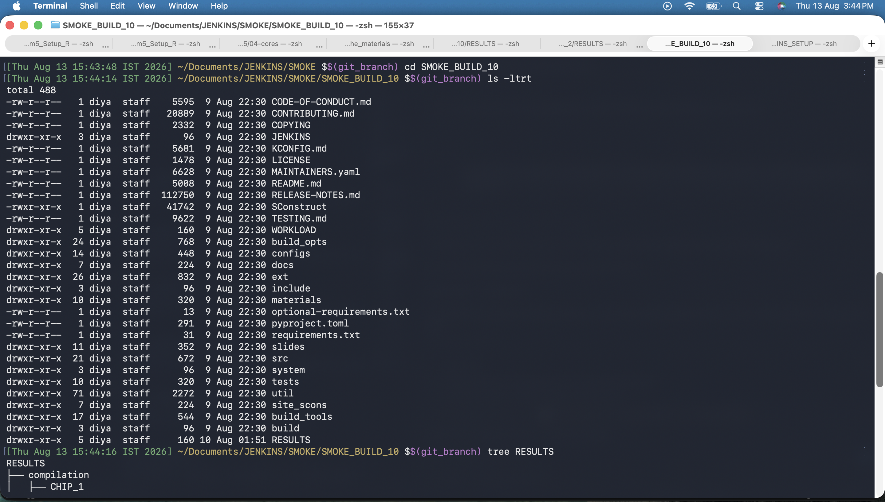
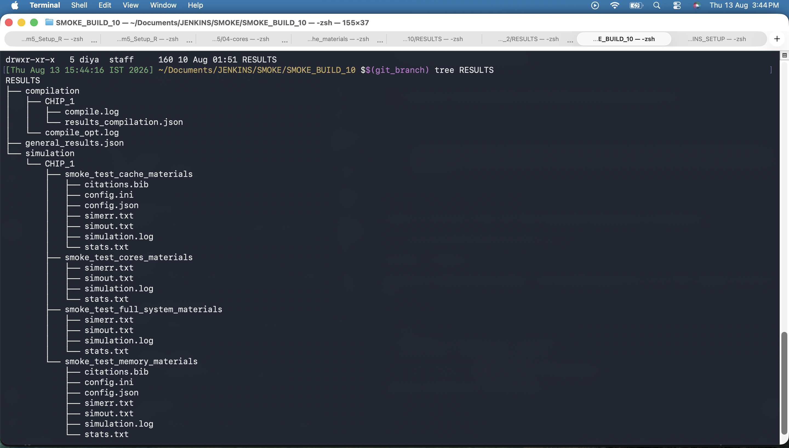
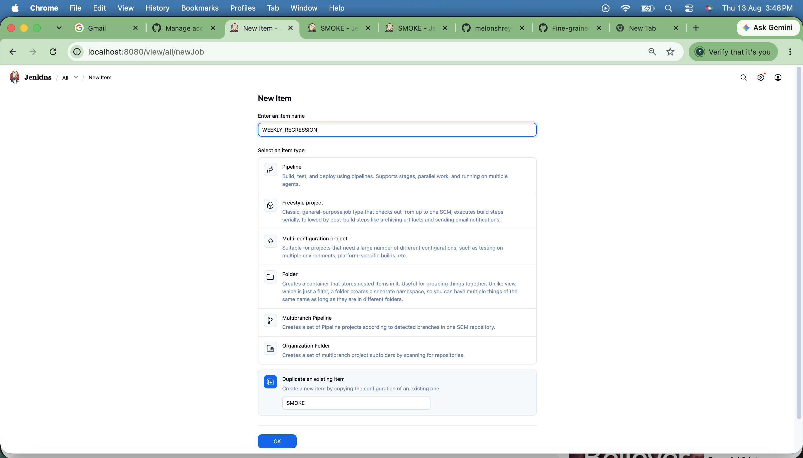
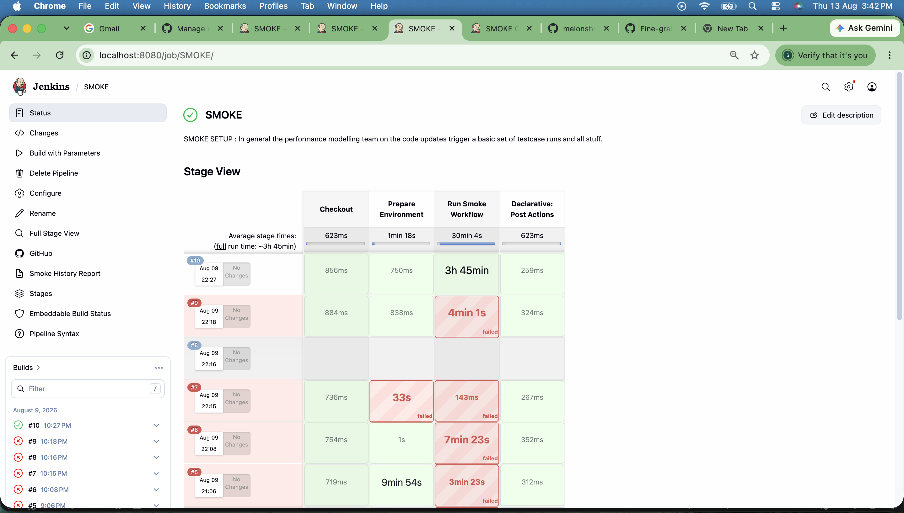

# Weekly Regression Workflow for gem5

This folder contains the weekly regression workflow used to compile gem5, run the configured regression simulation set, and generate HTML/JSON reports for trend tracking.

## Contents

- `jenkins_weekly.py` - main orchestration script for the weekly workflow
- `jenkins_weekly_html.py` - HTML/JSON report generation for weekly results and history
- `send_email_report.py` - helper to email the generated weekly history HTML report
- `chip_configuration.json` - chip and testcase configuration used by the weekly run
- `jenkins_weekly.groovy` - Jenkins pipeline definition for weekly regression runs
- `test_jenkins_weekly.py` - basic workflow helper tests
- `docs/` - Jenkins screenshots referenced by this README

## Workflow Overview

The weekly workflow can:

- clone or reuse a repository checkout
- collect git metadata
- compile gem5 in `opt` or `debug` mode
- run configured weekly regression simulation cases
- write summary artifacts into a run output directory
- generate HTML and JSON reports
- optionally email the generated weekly history report

## Typical Usage

Run from repository root:

```bash
python3 JENKINS/WEEKLY_REGRESSION/jenkins_weekly.py \
  --input-dir /Users/diya/Documents/JENKINS/WEEKLY_REGRESSION \
  --output-dir /Users/diya/Documents/JENKINS/WEEKLY_REGRESSION/WEEKLY_BUILD_3 \
  --branch stable \
  --chip-configuration /Users/diya/Documents/gem5_Setup_R/JENKINS/WEEKLY_REGRESSION/chip_configuration.json \
  --compile opt
```

### Quick-start Examples

1. Full weekly run:

```bash
python3 JENKINS/WEEKLY_REGRESSION/jenkins_weekly.py \
  --input-dir /Users/diya/Documents/JENKINS/WEEKLY_REGRESSION \
  --output-dir /Users/diya/Documents/JENKINS/WEEKLY_REGRESSION/WEEKLY_BUILD_3 \
  --branch stable \
  --chip-configuration /Users/diya/Documents/gem5_Setup_R/JENKINS/WEEKLY_REGRESSION/chip_configuration.json \
  --compile opt
```

2. Skip compilation and simulation:

```bash
python3 JENKINS/WEEKLY_REGRESSION/jenkins_weekly.py \
  --input-dir /Users/diya/Documents/JENKINS/WEEKLY_REGRESSION \
  --output-dir /Users/diya/Documents/JENKINS/WEEKLY_REGRESSION/WEEKLY_BUILD_3 \
  --branch stable \
  --chip-configuration /Users/diya/Documents/gem5_Setup_R/JENKINS/WEEKLY_REGRESSION/chip_configuration.json \
  --skip-compilation \
  --skip_simulation
```

3. Dry run preview:

```bash
python3 JENKINS/WEEKLY_REGRESSION/jenkins_weekly.py \
  --input-dir /Users/diya/Documents/JENKINS/WEEKLY_REGRESSION \
  --output-dir /Users/diya/Documents/JENKINS/WEEKLY_REGRESSION/WEEKLY_BUILD_3 \
  --branch stable \
  --chip-configuration /Users/diya/Documents/gem5_Setup_R/JENKINS/WEEKLY_REGRESSION/chip_configuration.json \
  --dry_run
```

### Useful Flags

- `--chip-name ALL` - run all chips in configuration
- `--skip-compilation` - skip compile step
- `--skip_simulation` - skip simulation and still generate reports
- `--dry_run` - print planned commands without executing
- `--send-email` - email weekly history report

## Jenkins Pipeline

Weekly pipeline definition is in [JENKINS/WEEKLY_REGRESSION/jenkins_weekly.groovy](JENKINS/WEEKLY_REGRESSION/jenkins_weekly.groovy).

Pipeline highlights:

- checks out repository/workspace content
- discovers chip names from `chip_configuration.json`
- runs weekly workflow with selected chip and compile mode
- archives generated JSON/HTML artifacts
- publishes weekly history HTML report in Jenkins

Example parameters:

- `BRANCH=stable`
- `COMPILE_TARGET=opt`
- `CHIP_NAME=ALL`
- `SKIP_COMPILATION=false`
- `SKIP_SIMULATION=false`
- `DRY_RUN=false`

## Output Layout

Typical weekly output layout:

```text
/Users/diya/Documents/JENKINS/WEEKLY_REGRESSION/
└── WEEKLY_BUILD_<N>/
    ├── build/
    │   └── ALL/
    │       └── gem5.opt
    ├── RESULTS/
    │   ├── general_results.json
    │   ├── weekly_results.html
    │   ├── weekly_results.json
    │   ├── compilation/
    │   └── simulation/
    └── ...
```

History report files:

- `/Users/diya/Documents/JENKINS/HISTORY/WEEKLY_REGRESSION/jenkins_history_weekly_results.html`
- `/Users/diya/Documents/JENKINS/HISTORY/WEEKLY_REGRESSION/jenkins_history_weekly_results.json`
- `/Users/diya/Documents/JENKINS/HISTORY/WEEKLY_REGRESSION/history_results.json`

## Jenkins Screenshots

### Weekly Report View



### Weekly Run Details Snapshot



### Weekly Folder in JENKINS Root


### Jenkins New Item for Weekly Job



### Pipeline Stage View



## Notes

- This README mirrors the SMOKE documentation style with weekly-specific scripts and paths.
- If you add newer screenshots, place them in `JENKINS/WEEKLY_REGRESSION/docs/` and update image links in this file.
